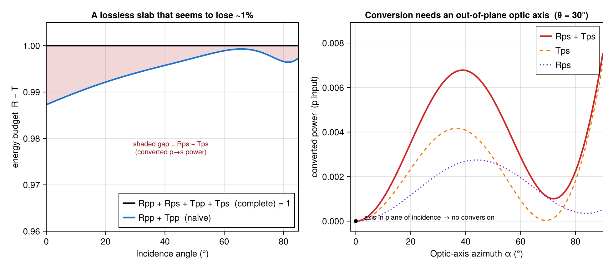

# Energy budget of a rotated anisotropic slab

A lossless slab cannot absorb light, so reflectance and transmittance must add to
one: ``R + T = 1``. Build a uniaxial crystal whose optic axis is tilted **out of
the plane of incidence**, though, and the obvious bookkeeping seems to break.

## The naive budget comes up short

Take a calcite-like slab (``n_o = 1.658``, ``n_e = 1.486``, lossless) in air and
orient its optic axis out of plane with `euler = (π/6, π/4, 0)`:

```julia
using TransferMatrix
air  = Layer(λ -> 1.0, 1.0)
slab = Layer(λ -> 1.658, λ -> 1.658, λ -> 1.486, 0.5; euler = (π/6, π/4, 0.0))

r = transfer(1.0, [air, slab, air])          # normal incidence
r.Rpp + r.Tpp        # ≈ 0.9873  — looks like 1.3% has vanished
```

The slab is transparent, yet `Rpp + Tpp ≈ 0.987`. No energy is actually lost — the
budget is simply incomplete.

## The missing pieces are the converted channels

A rotated anisotropic crystal does something an isotropic film never does: it
**converts polarization**. Send in a purely p‑polarized wave and a small
s‑polarized component appears in *both* directions — the cross‑polarized
reflectance `Rps` and the cross‑polarized transmittance `Tps`. That converted
light is real, carries energy, and is exactly what the naive sum omits. Adding
both channels closes the budget to machine precision:

```julia
r.Rpp + r.Rps + r.Tpp + r.Tps        # = 1.0   (to ~1e-15)
```

A few conventions make this add up cleanly:

  - The coefficient is indexed `r_{in,out}`, so the **p‑input** cross‑reflection is
    `Rps` (not `Rsp`, which is the *s*-input term — the two coincide only at normal
    incidence).
  - Every transmittance is a **per‑mode Poynting flux**: `Tpp` is the power carried
    by the p‑like substrate eigenmode alone, `Tps` the power carried by the s‑like
    eigenmode, each evaluated with its own wavevector. The four channels therefore
    partition the transmitted energy exactly — nothing is counted twice.

The per‑input‑polarization statements of energy conservation are therefore

```math
R_{pp} + R_{ps} + T_{pp} + T_{ps} = 1, \qquad R_{ss} + R_{sp} + T_{ss} + T_{sp} = 1 .
```



**Panel (a)** sweeps the incidence angle with the optic axis held out of plane. The
naive `Rpp + Tpp` (blue) dips below one at every angle; the complete
`Rpp + Rps + Tpp + Tps` (black) is flat at one. The shaded gap between them *is*
the converted power `Rps + Tps`.

**Panel (b)** explains *when* the conversion happens. Holding the incidence angle
fixed and rotating the optic axis in azimuth, the converted power is exactly zero
when the axis lies in the plane of incidence (`α = 0`): there the mirror symmetry
of the problem keeps p and s decoupled, just like an isotropic medium. Tilt the
axis out of that plane and the conversion — and the apparent energy "leak" —
switches on, mostly in transmission (`Tps`) with a smaller reflected share (`Rps`).

The lesson generalizes: for any anisotropic stack, always account for the
cross‑polarized channels — both reflected *and* transmitted — before concluding
that energy is or isn't conserved.

The full runnable script is [`examples/anisotropic_energy_budget.jl`](https://github.com/garrekstemo/TransferMatrix.jl/blob/main/examples/anisotropic_energy_budget.jl).
