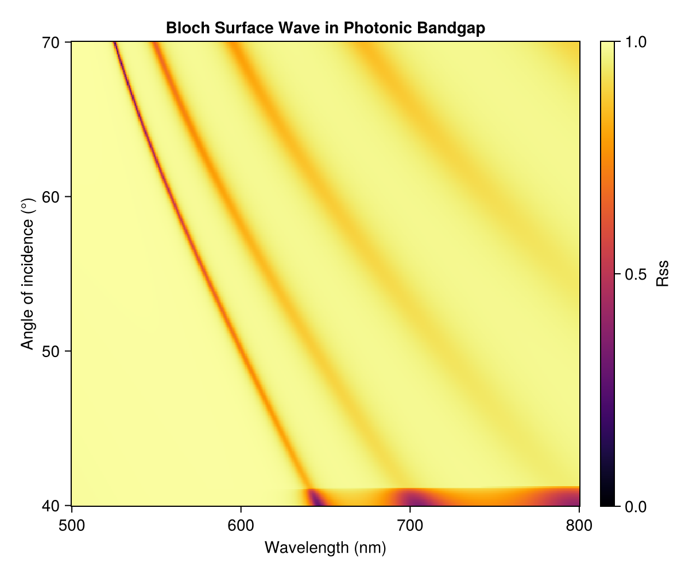

# Bloch Surface Wave

A Bloch surface wave (BSW) is a surface mode that lives at the termination of a truncated photonic crystal. It exists inside the photonic bandgap and is evanescently confined to the surface, making it highly sensitive to surface conditions. The mode is excited via prism coupling (Kretschmann-like geometry) and appears as a narrow, sharp dip threading through the bright stopband in an angle-resolved reflectance map. Like the [vibrational polariton example](polariton_dispersion.md), `sweep_angle` produces an angle–wavelength heatmap — but here a single surface-mode dip is the signature rather than an avoided-crossing anticrossing.



The key construction:

```julia
λ_0 = 0.633  # μm, design wavelength
t_tio2 = λ_0 / (4 * n_tio2(λ_0))
t_sio2 = λ_0 / (4 * n_sio2(λ_0))

prism = Layer(n_prism, 0.5)
tio2  = Layer(n_tio2, t_tio2)
sio2  = Layer(n_sio2, t_sio2)
air   = Layer(n_air, 0.5)

# Truncated DBR: prism | 8 × (TiO2/SiO2) | TiO2 | air
# The terminal TiO2 (high-index) layer supports the surface mode.
nperiods = 8
layers = [prism, repeat([tio2, sio2], nperiods)..., tio2, air]

λs = range(0.50, 0.80, length=400)
θs = deg2rad.(range(40, 70, length=300))
spectra = sweep_angle(λs, θs, layers)
```

The full runnable script is [`examples/bloch_surface_wave.jl`](https://github.com/garrekstemo/TransferMatrix.jl/blob/main/examples/bloch_surface_wave.jl).
