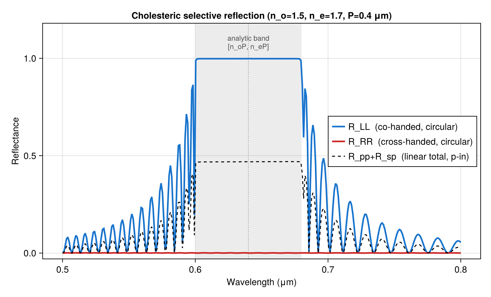

# Cholesteric Circular Bragg

A cholesteric (chiral nematic) liquid crystal is a stack of birefringent layers whose optic axis rotates helically about the propagation axis with a fixed pitch P. This structure is not intrinsically optically active — each individual slice is an ordinary uniaxial crystal — yet the helical geometry causes it to reflect circularly polarized light of one handedness almost totally inside a Bragg band, while passing the opposite handedness. This "circular Bragg" / selective reflection effect is the working principle of reflective cholesteric-LC polarizers and color filters (de Gennes & Prost, 1993; Berreman & Scheffer, Phys. Rev. Lett. 25, 577, 1970).

The band center, edges, and width follow the standard analytic rules:
- Center: λ₀ = n̄ P (n̄ = mean index)
- Edges: n_o P < λ < n_e P
- Width: Δλ = Δn P

Critically, the linear-basis spectra (Rpp, Rss) hide the handedness: both equal ≈ 0.5 inside the band, revealing nothing about which circular component is reflected. The `basis=:circular` option splits it cleanly into R_LL (co-handed, reflected) and R_RR (cross-handed, transmitted), demonstrating precisely why the circular basis exists.



The key construction:

```julia
n_o = 1.5;  n_e = 1.7;  P = 0.40  # μm
q = 2π / P

# Build the helix as fine rotated uniaxial slices
d_slice = P / slices_per_pitch
slices = [Layer(λ -> n_o + 0im, λ -> n_o + 0im, λ -> n_e + 0im, d_slice;
                euler = (q * (i - 0.5) * d_slice, π/2, 0.0)) for i in 1:n_slices]
layers = [ambient; slices; ambient]

# Circular-basis spectra
for (i, λ) in enumerate(λs)
    rc = transfer(λ, layers; basis = :circular)
    R_LL[i] = rc.Rll    # co-handed: reflected
    R_RR[i] = rc.Rrr    # cross-handed: transmitted
end
```

The full runnable script is [`examples/cholesteric_circular_bragg.jl`](https://github.com/garrekstemo/TransferMatrix.jl/blob/main/examples/cholesteric_circular_bragg.jl).
