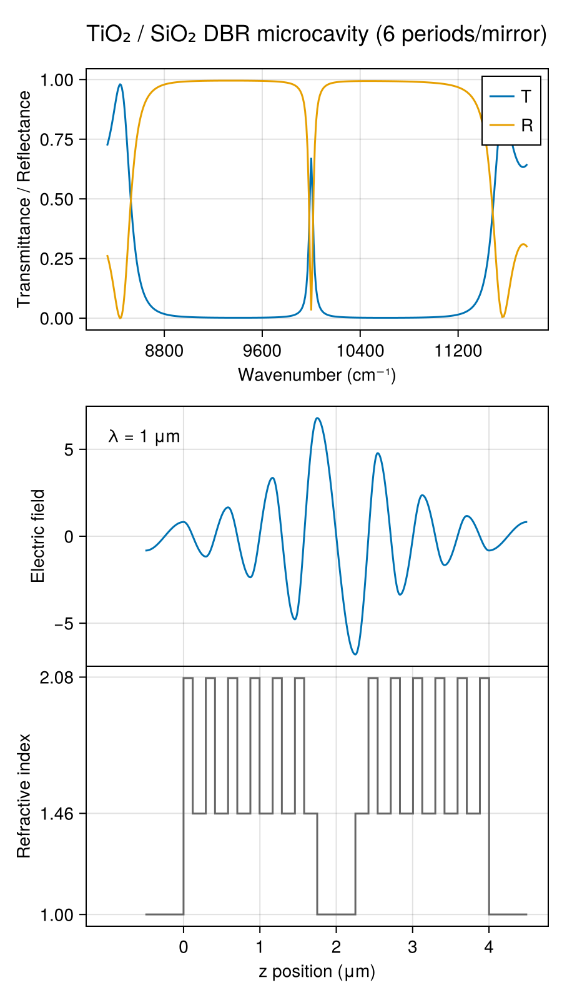

# DBR Microcavity

A distributed Bragg reflector (DBR) is a periodic stack of quarter-wave high- and low-index layers (here TiO₂/SiO₂) that creates a photonic stopband with near-unity reflectance. Sandwiching a half-wave spacer between two DBR mirrors forms a microcavity: a sharp transmission resonance appears inside the stopband, localized by the photonic bandgap on both sides. The electric field profile at the cavity resonance shows the characteristic standing wave that is strongly enhanced at the cavity center and decays exponentially into the DBR mirrors.



The key construction:

```julia
λ_0 = 1.0   # μm, design wavelength
t_tio2 = λ_0 / (4 * n_tio2(λ_0))   # quarter-wave TiO2
t_sio2 = λ_0 / (4 * n_sio2(λ_0))   # quarter-wave SiO2
t_middle = λ_0 / 2                   # half-wave spacer

tio2 = Layer(n_tio2, t_tio2)
sio2 = Layer(n_sio2, t_sio2)
dbr_unit = [tio2, sio2]
nperiods = 6
layers = [air, repeat(dbr_unit, nperiods)..., air, repeat(reverse(dbr_unit), nperiods)..., air]

res = transfer(λ, layers)
field = efield(λ_0, layers)
```

The full runnable script is [`examples/dbr_cavity.jl`](https://github.com/garrekstemo/TransferMatrix.jl/blob/main/examples/dbr_cavity.jl).
