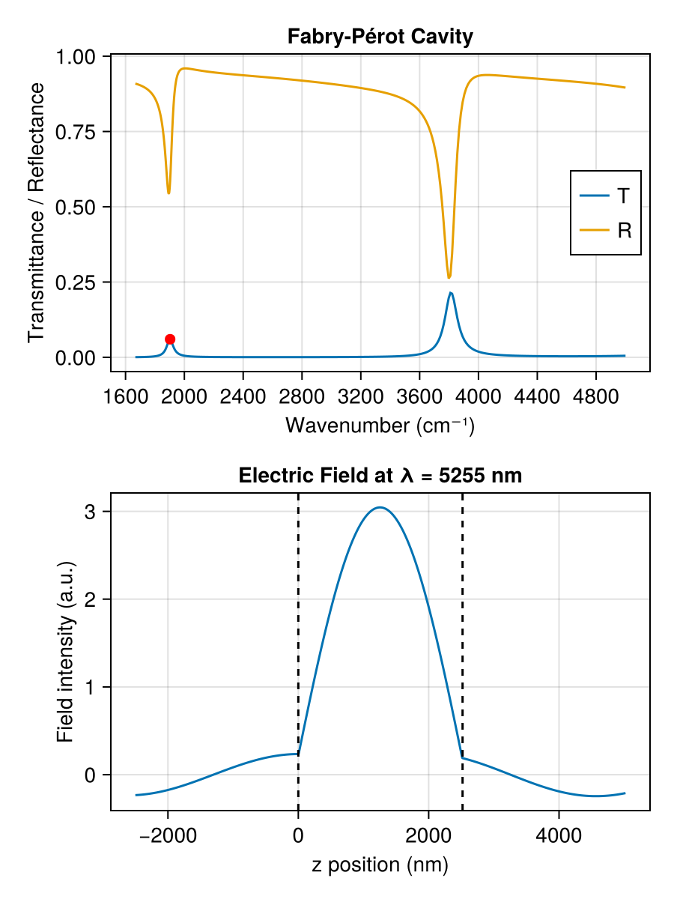

# Fabry–Pérot Cavity

A Fabry–Pérot cavity is formed by two partially reflective mirrors separated by a resonant spacer. When the round-trip phase accumulates to a multiple of 2π, light builds up resonantly and transmittance peaks sharply. Here, two thin gold films sandwich a half-wave air spacer, creating a mid-infrared cavity resonance near the design wavelength. The electric field profile at the resonance peak reveals the standing-wave enhancement inside the spacer.



The key construction:

```julia
air = RefractiveMaterial("other", "air", "Ciddor")
au  = RefractiveMaterial("main", "Au", "Rakic-LD")

λ_0 = 5.0           # design wavelength (μm)
t_middle = λ_0 / 2  # half-wave spacer

air = Layer(air, t_middle)  # rebind air/au as Layers
au  = Layer(au, 0.01)
layers = [air, au, air, au, air]

λs = range(2.0, 6.0, length = 500)
for λ in λs
    res = transfer(λ, layers)
    push!(Tpp, res.Tpp)
    push!(Rpp, res.Rpp)
end

field = efield(λ_res, layers)
```

The full runnable script is [`examples/fabry-perot.jl`](https://github.com/garrekstemo/TransferMatrix.jl/blob/main/examples/fabry-perot.jl).
