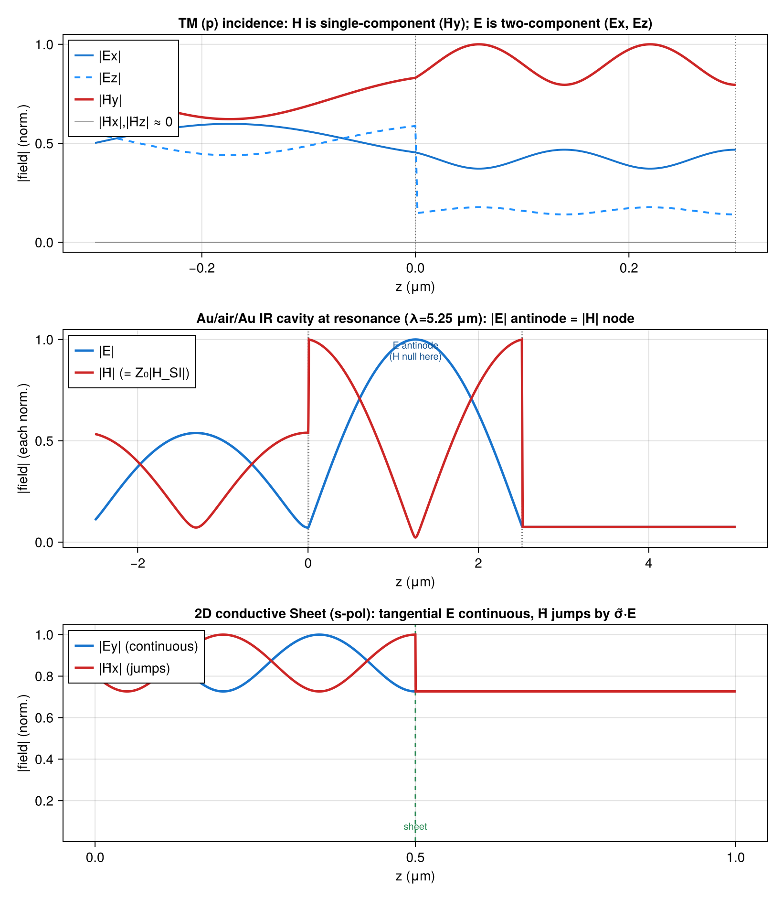

# Field Profiles (E and H)

`efield` and `hfield` return the full vectorial electric and impedance-normalized magnetic field (H̃ = Z₀ H_SI) as a function of depth through the stack, sampled at spacing `dz`. Three phenomena are only visible once both fields are computed together. First, TM duality: for p-polarized oblique incidence the magnetic field is a single transverse component (H̃y) while the electric field genuinely splits into Ex and Ez. Second, E/H complementarity: in a resonant cavity the |E| antinodes coincide with |H| nodes — a molecule at the field maximum sits in a magnetic null. Third, Sheet H-jump: across a 2D conductive `Sheet` the tangential E field is continuous while H̃ jumps by the surface current σ̃·E, an H-only observable that cannot be seen from |E| alone.



The key construction:

```julia
# Panel A: TM duality at oblique incidence
θ = deg2rad(45); λA = 0.6; dz = 0.002
efA = efield(λA, layersA; θ=θ, dz=dz)
hfA = hfield(λA, layersA; θ=θ, dz=dz)

# Panel B: E/H complementarity in an Au/air/Au Fabry–Pérot cavity
ef = efield(λres, layers; dz=0.002)
hf = hfield(λres, layers; dz=0.002)

# Panel C: H-jump across a 2D conductive Sheet (s-incidence)
sheetsC = Dict(2 => Sheet(σ_s))
efC = efield(0.6, layersC; dz=5e-4, sheets=sheetsC)
hfC = hfield(0.6, layersC; dz=5e-4, sheets=sheetsC)
```

The full runnable script is [`examples/field_profiles.jl`](https://github.com/garrekstemo/TransferMatrix.jl/blob/main/examples/field_profiles.jl).
