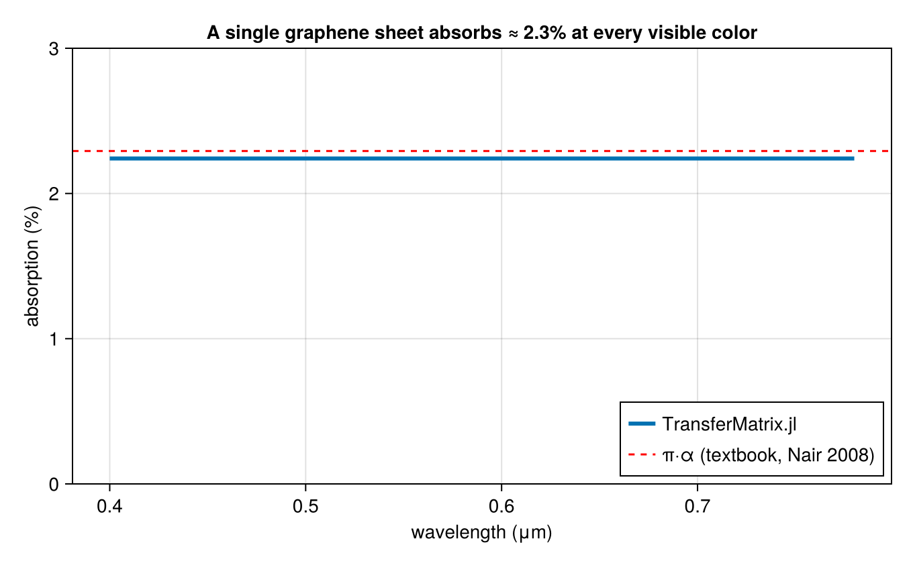

# Graphene Absorption

A single graphene sheet absorbs exactly πα ≈ 2.3% of incident light across the entire visible spectrum, where α = 1/137 is the fine-structure constant — a remarkable result that ties an optical measurement directly to a fundamental constant (R. R. Nair et al., Science 320, 1308, 2008). This example models graphene as a zero-thickness `Sheet` with its universal optical conductivity σ₀ = e²/4ħ and confirms that `transfer` reproduces the famous 2.3% figure. It is the simplest possible validation that the conductive-sheet feature is physically correct: the answer is a number you can look up.



The key construction:

```julia
e = 1.602176634e-19     # elementary charge (C)
ħ = 1.054571817e-34     # reduced Planck constant (J·s)
σ₀ = e^2 / (4ħ)        # graphene's universal optical conductivity (S)

# Free-standing graphene: vacuum on both sides
vacuum = Layer(λ -> 1.0 + 0.0im, 0.0)
layers = [vacuum, vacuum]

# Place the sheet at the single interface (between layer 1 and layer 2)
sheets = Dict(1 => Sheet(σ₀))

λs = range(0.40, 0.78, length = 200)
Aλ = [1 - transfer(λ, layers; sheets).Tss - transfer(λ, layers; sheets).Rss for λ in λs]
```

The full runnable script is [`examples/graphene_absorption.jl`](https://github.com/garrekstemo/TransferMatrix.jl/blob/main/examples/graphene_absorption.jl).
