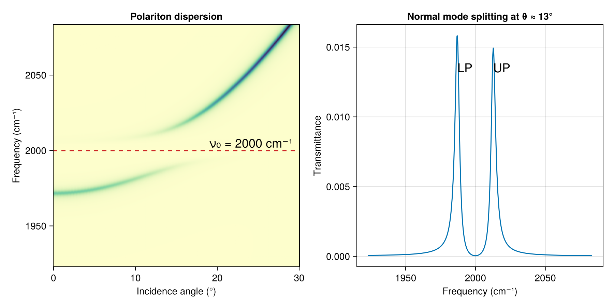

# Vibrational Polariton Dispersion

When a molecular vibration strongly couples to a cavity photon mode, the system eigenstates hybridize into upper (UP) and lower (LP) polariton branches separated by the vacuum Rabi splitting. By varying the angle of incidence the photon mode is tuned through the molecular resonance, and `sweep_angle` maps the resulting anticrossing in a transmittance heatmap. This is the same `sweep_angle` workflow as the [Bloch surface wave example](bloch_surface_wave.md), but the physics is qualitatively different: instead of a single sharp surface-mode dip threading the stopband, here two coupled branches repel around the bare resonance frequency.

**Dispersive layer construction.** The absorbing cavity material has a frequency-dependent refractive index described by a Lorentz oscillator model. The complex dielectric function ε = ε₁ + iε₂ is computed on the wavelength grid `λs`, converted to (n, k) arrays, and passed directly to `Layer`:

```julia
ε1 = dielectric_real(νs, p0) .+ n_bg^2
ε2 = dielectric_imag(νs, p0)
n_medium = @. sqrt((sqrt(abs2(ε1) + abs2(ε2)) + ε1) / 2)
k_medium = @. sqrt((sqrt(abs2(ε1) + abs2(ε2)) - ε1) / 2)

absorber = Layer(λs, n_medium, k_medium, t_cav)
```

The `Layer(λs, n, k, t)` constructor stores the tabulated dispersion; at each wavelength `transfer` interpolates n + ik for that layer. The same construction is used in the [thickness dependence example](thickness_dependence.md).



The key construction:

```julia
# DBR mirrors around the dispersive cavity layer
nperiods = 6
unit = [tio2, sio2]
layers = [air, repeat(unit, nperiods)..., absorber, repeat(reverse(unit), nperiods)..., air]

# Angle-resolved transmittance heatmap reveals UP/LP anticrossing
θs = range(0, 30, length = 400)
res = sweep_angle(λs, deg2rad.(θs), layers)
```

The full runnable script is [`examples/polariton_dispersion.jl`](https://github.com/garrekstemo/TransferMatrix.jl/blob/main/examples/polariton_dispersion.jl).
