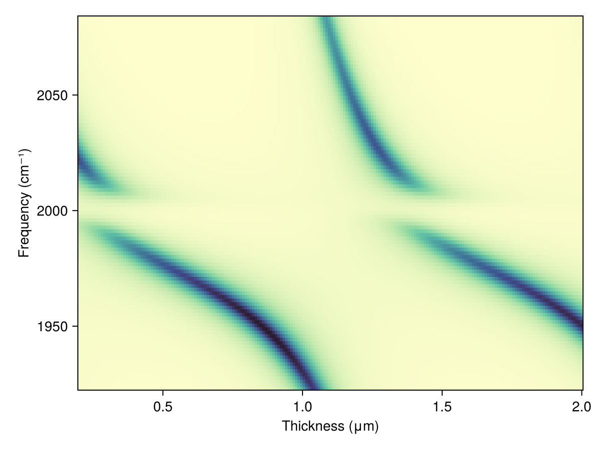

# Thickness Dependence

When the thickness of a cavity layer is continuously tuned, the cavity photon mode shifts in frequency because the round-trip phase condition changes. If the cavity contains a dispersive absorber (as in the [polariton dispersion example](polariton_dispersion.md)), the photon mode sweeps through the molecular resonance and the resulting heatmap traces the avoided-crossing anticrossing as a function of layer thickness rather than angle. `sweep_thickness` automates this scan: it replaces the thickness of one layer index across a range while holding everything else fixed.



The key construction:

```julia
# Dispersive absorber built via Lorentz → (n, k) → Layer(λs, n, k, t)
# (see the polariton dispersion example for this construction)
absorber = Layer(λs, n_medium, k_medium, t_cav)

nperiods = 4
unit = [tio2, sio2]
layers = [air, repeat(unit, nperiods)..., absorber, repeat(reverse(unit), nperiods)..., air]

# Sweep the absorber layer (index 14 in this stack) over a range of thicknesses
thicknesses = range(0.2, 2.0, length = 200)
res = sweep_thickness(λs, thicknesses, layers, 14)
```

The full runnable script is [`examples/thickness_dependence.jl`](https://github.com/garrekstemo/TransferMatrix.jl/blob/main/examples/thickness_dependence.jl).
