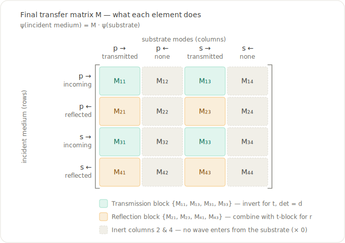
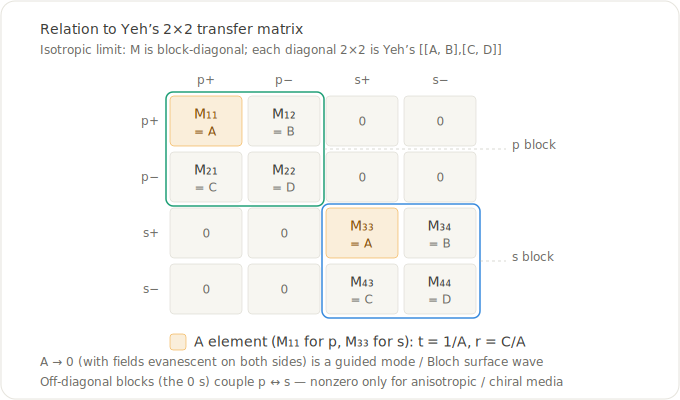
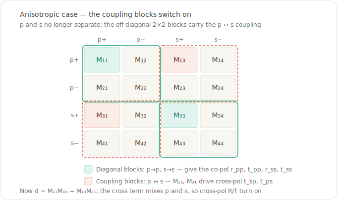

# Anatomy of the transfer matrix

The method collapses an entire layered stack into a single ``4\times4`` matrix,
and every reflectance and transmittance number is read straight off it. This
page explains what that matrix is and what each of its elements means.

[`transfer`](@ref) returns a [`TransferResult`](@ref) of ``R``/``T`` values; the
matrix itself is the first item returned by the internal `TransferMatrix.propagate`:

```julia
M, S, Ds, Ps, γs = TransferMatrix.propagate(1.0, layers; θ=0.3)
M  # the 4×4 complex transfer matrix for the whole stack
```

!!! note "A note on the symbol"
    This page calls the final transfer matrix ``M``, matching Yeh (1979), whose
    per-polarization ``2\times2`` matrix is the building block we map onto below.
    The source code calls the same object ``\Gamma`` (specifically ``\Gamma^*``
    after reordering into Yeh's field convention) — it is the same matrix.

## What the matrix represents

``M`` connects the four plane-wave mode amplitudes on the two sides of the stack:

```math
\psi_\text{inc} = M\,\psi_\text{sub},
\qquad
\psi = \begin{pmatrix} p^{+} \\ p^{-} \\ s^{+} \\ s^{-} \end{pmatrix},
```

where ``+`` is the forward (``+z``) mode and ``-`` the backward (``-z``) mode of
each polarization. **Rows** index modes in the incident medium; **columns**
index modes in the substrate. On the incident side the forward modes are the
*incoming* wave and the backward modes are the *reflected* wave; on the substrate
side the forward modes are the *transmitted* wave and the backward modes are
absent — nothing illuminates the stack from behind.



## Which elements carry the physics

Because the backward-substrate amplitudes are zero, **columns 2 and 4 multiply
zero and never affect an observable** — only columns 1 and 3 act. The active
elements split into two blocks.

**Transmission block** — rows ``\{1,3\}`` × columns ``\{1,3\}``. Its determinant
is the shared denominator, and its inverse is the transmission Jones matrix:

```math
d = M_{11}M_{33} - M_{13}M_{31},
```
```math
t_{pp} = \frac{M_{33}}{d}, \quad
t_{ss} = \frac{M_{11}}{d}, \quad
t_{ps} = -\frac{M_{31}}{d}, \quad
t_{sp} = -\frac{M_{13}}{d}.
```

**Reflection block** — rows ``\{2,4\}`` × columns ``\{1,3\}``, read out against
the same transmission block:

```math
\begin{aligned}
r_{pp} &= \frac{M_{21}M_{33} - M_{23}M_{31}}{d}, &
r_{ss} &= \frac{M_{11}M_{43} - M_{41}M_{13}}{d}, \\[4pt]
r_{ps} &= \frac{M_{41}M_{33} - M_{43}M_{31}}{d}, &
r_{sp} &= \frac{M_{11}M_{23} - M_{21}M_{13}}{d}.
\end{aligned}
```

Reflectance is then ``R = |r|^2`` directly, while every transmittance ``T`` —
co- and cross-polarized alike — is a Poynting-vector flux ratio rather than
``|t|^2`` (the transmitted wave lives in a different medium): each channel is the
flux of one substrate eigenmode, evaluated with its own wavevector — see
[Physics Validation](validation.md). The amplitude formulas above are exactly
what [`calculate_tr`](@ref) evaluates.

The full ``16``-element map:

| Element | incident mode (row) | substrate mode (col) | appears in |
|:--|:--|:--|:--|
| ``M_{11}`` | ``p^{+}`` incoming  | ``p^{+}`` transmitted | ``d``, ``t_{ss}``, ``r_{ss}``, ``r_{sp}`` |
| ``M_{12}`` | ``p^{+}`` incoming  | ``p^{-}`` (absent) | — inert |
| ``M_{13}`` | ``p^{+}`` incoming  | ``s^{+}`` transmitted | ``d``, ``t_{sp}``, ``r_{ss}``, ``r_{sp}`` |
| ``M_{14}`` | ``p^{+}`` incoming  | ``s^{-}`` (absent) | — inert |
| ``M_{21}`` | ``p^{-}`` reflected | ``p^{+}`` transmitted | ``r_{pp}``, ``r_{sp}`` |
| ``M_{22}`` | ``p^{-}`` reflected | ``p^{-}`` (absent) | — inert |
| ``M_{23}`` | ``p^{-}`` reflected | ``s^{+}`` transmitted | ``r_{pp}``, ``r_{sp}`` |
| ``M_{24}`` | ``p^{-}`` reflected | ``s^{-}`` (absent) | — inert |
| ``M_{31}`` | ``s^{+}`` incoming  | ``p^{+}`` transmitted | ``d``, ``t_{ps}``, ``r_{pp}``, ``r_{ps}`` |
| ``M_{32}`` | ``s^{+}`` incoming  | ``p^{-}`` (absent) | — inert |
| ``M_{33}`` | ``s^{+}`` incoming  | ``s^{+}`` transmitted | ``d``, ``t_{pp}``, ``r_{pp}``, ``r_{ps}`` |
| ``M_{34}`` | ``s^{+}`` incoming  | ``s^{-}`` (absent) | — inert |
| ``M_{41}`` | ``s^{-}`` reflected | ``p^{+}`` transmitted | ``r_{ps}``, ``r_{ss}`` |
| ``M_{42}`` | ``s^{-}`` reflected | ``p^{-}`` (absent) | — inert |
| ``M_{43}`` | ``s^{-}`` reflected | ``s^{+}`` transmitted | ``r_{ps}``, ``r_{ss}`` |
| ``M_{44}`` | ``s^{-}`` reflected | ``s^{-}`` (absent) | — inert |

## Isotropic limit: Yeh's 2×2 matrices

The field ordering ``(p^{+}, p^{-}, s^{+}, s^{-})`` keeps the two p-modes adjacent
and the two s-modes adjacent. So for isotropic (or optic-axis-aligned) media,
where p and s do not mix, ``M`` is **block-diagonal**, and each diagonal
``2\times2`` block *is* Yeh's transfer matrix for that polarization:

```math
\begin{pmatrix} A & B \\ C & D \end{pmatrix},
\qquad A = M_{11}\ (\text{p}), \quad A = M_{33}\ (\text{s}).
```

With no backward wave in the substrate, Yeh's relation gives ``t = 1/A`` and
``r = C/A`` — which is exactly the block formulas above specialized to
``M_{13}=M_{31}=0`` (so ``d = M_{11}M_{33}``, ``t_{pp}=1/M_{11}``,
``r_{pp}=M_{21}/M_{11}``, and likewise for s).



### Bound modes and Bloch surface waves

A guided (bound) mode is a **pole of ``r`` and ``t``** — a self-sustaining field
with *no* incident wave — i.e. the denominator vanishes. In the decoupled case
that is ``A = 0``: ``M_{11}=0`` for a p-polarized mode, ``M_{33}=0`` for an
s-polarized mode (in the full coupled problem it generalizes to ``d=0``).

A **Bloch surface wave** (BSW) is the bound mode at the truncation of a periodic
multilayer (e.g. a DBR). It lives inside a photonic band gap of the stack — so it
decays into the periodic side — and below the light line of the outer cladding —
so it decays into the cladding. To find one with this package:

1. Use a high-index coupling prism as the incident (first) layer so that the
   in-plane wavevector ``\beta = k_0\,\xi`` can exceed the cladding light line.
2. Scan angle/wavelength with [`sweep_angle`](@ref) past the critical angle; the
   BSW appears as a sharp dip in the reflectance (``R_{pp}`` or ``R_{ss}``) where
   ``A`` passes through its zero.
3. Confirm it with [`efield`](@ref): the field is localized and strongly enhanced
   at the truncation surface.

## Anisotropic and chiral media

When the media are anisotropic or chiral, p and s couple and the **off-diagonal
blocks switch on**. The elements ``M_{13}`` and ``M_{31}`` drive the
cross-polarized transmission (``t_{sp} = -M_{13}/d``, ``t_{ps} = -M_{31}/d``),
and the determinant picks up the cross term:

```math
d = M_{11}M_{33} - M_{13}M_{31}.
```

That cross term ties the p and s poles together, so a bound mode at ``d = 0`` is
generally a **mixed-polarization** surface mode rather than a pure p or s one.
The cross-polarization observables ``R_{ps}, R_{sp}, T_{ps}, T_{sp}`` — exactly
zero for isotropic media — become nonzero; this same coupling is what the
[Circular-polarization basis](tutorial.md#Circular-polarization-basis) output reflects.



## Numerical backends: `method=:exp` vs `:eig`

`transfer`, `sweep_angle`, and `sweep_thickness` accept `method`:

- **`:exp`** (default) propagates each interior layer with the matrix exponential of
  the Berreman Δ matrix. It avoids eigenmode sorting entirely, so it is
  degeneracy-immune and handles near-degenerate or mixed propagating/evanescent
  interior layers robustly.
- **`:eig`** is the eigenmode/dynamical-matrix path, kept as an independent
  cross-check (`transfer(λ, layers; method=:eig)`).

The two agree to ~1e-12. The semi-infinite ambient and substrate always use the
eigenmode path, so the boundary limitations (anisotropic ambient, issue #71;
anisotropic substrate under total internal reflection, issue #107) apply to both.

See the [bibliography](../bibliography.md) ("Matrix-exponential layer propagator")
for references.
