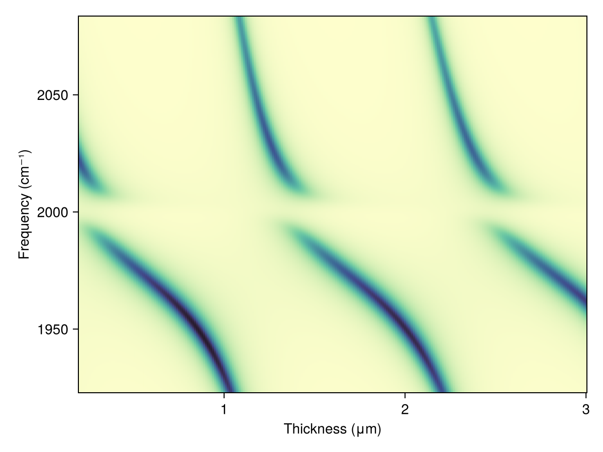

# Tutorial

## Installation

TransferMatrix.jl is a part of Julia's general registry and the source code can be found at <https://github.com/garrekstemo/TransferMatrix.jl>.
From the [Julia REPL](https://docs.julialang.org/en/v1/stdlib/REPL/), enter the package manager mode mode by typing `]`.
Then just enter the following to install the package:

```julia
pkg> add TransferMatrix
```


## A simple calculation

To get up and running, let's build a simple two-layer structure of air and glass
and calculate the reflectance and transmittance to visualize the [Brewster angle](https://en.wikipedia.org/wiki/Brewster%27s_angle) for p-polarized light.
We fix the wavelength of incident light and vary the angle of incidence.

We start by making a `Layer` of air and a `Layer` of glass. We'll do this for 
a wavelength of 1 μm. Since there are only two layers and the transfer matrix method
treats the first and last layers as semi-infinite, there is no need to provide a thickness
for our glass and air layers. From the examples below, you can see that there are fields for

- the material
- the layer thickness

The material is a `RefractiveMaterial` from the RefractiveIndex.jl package. You can also initize a `Layer` with data for the refractive index and extinction coefficient.


```@example tutorial
using TransferMatrix
using RefractiveIndex

n_air = RefractiveMaterial("other", "air", "Ciddor")
n_glass = RefractiveMaterial("glass", "soda-lime", "Rubin-clear")[1]
air = Layer(n_air, 0.1)
glass = Layer(n_glass, 0.1)
layers = [air, glass];
```

Now that we have our glass and air layers, we can iterate over the angles of incidence and compute the reflectance and transmittance for light of wavelength 1 μm.

```@example tutorial
λ = 1.0
θs = 0.0:1:85.0
result = sweep_angle([λ], deg2rad.(θs), layers; verbose=true);
```

Let's now plot the result using the [Makie.jl](https://makie.juliaplots.org/) data visualization package.

```@example tutorial
using CairoMakie

brewster = atan(n_glass(λ)) * 180 / π

f = Figure()
ax = Axis(f[1, 1], xlabel = "Incidence Angle (°)", ylabel = "Reflectance / Transmittance")
lines!(θs, result.Tss[:, 1], label = "Ts", color = :firebrick3)
lines!(θs, result.Tpp[:, 1], label = "Tp", color = :orangered3)
lines!(θs, result.Rss[:, 1], label = "Rs", color = :dodgerblue4)
lines!(θs, result.Rpp[:, 1], label = "Rp", color = :dodgerblue1)
vlines!(brewster, color = :black, linestyle = :dash)
text!(35, 0.6, text = "Brewster angle\n(Rp = 0)")

axislegend(ax)
f
```

We can see that the result of the angle-resolved calculation has four solutions: the s-wave and p-wave for both the reflected and transmitted waves. And we see that the Brewster angle
is ``\arctan\left( n_\text{glass} /n_\text{air} \right) \approx 56^{\circ}``, as expected.
Simultaneous calculation of s- and p-polarized incident waves is a feature of the 
general 4x4 transfer matrix method being used. The `sweep_angle` function
will also loop through all wavelengths so that you can plot
a color plot of wavelength and angle versus transmittance (or reflectance).


## A simple multi-layered structure

Now that we can make `Layer`s, we can put them together to calculate 
the transfer matrix for a multi-layered structure and plot the reflectance and transmittance spectra.
An important structure in optics is the Fabry-Pérot etalon, made with two parallel planar mirrors with a gap between them.
If we set the optical path length to be an integer multiple of half the wavelength, we get constructive interference and a resonance in the transmittance spectrum.
In the frequency domain, the cavity modes are evenly spaced by the free spectral range (FSR).
We will scan in the mid infrared between 4 and 6 μm and use data generated
via the [Lorentz-Drude model](https://en.wikipedia.org/wiki/Lorentz_oscillator_model) for each 10 nm-thick gold mirror. (Note that we stay in units of micrometers for the wavelength.)

```@example tutorial
caf2 = RefractiveMaterial("main", "CaF2", "Malitson")
au = RefractiveMaterial("main", "Au", "Rakic-LD")
air = RefractiveMaterial("other", "air", "Ciddor")

λ_0 = 5.0
t_middle = λ_0 / 2
air = Layer(air, t_middle)
au = Layer(au, 0.01)
layers = [air, au, air, au, air];

λs = range(2.0, 6.0, length = 500)
frequencies = 10^4 ./ λs

Tp = Float64[]
Ts = Float64[]
Rp = Float64[]
Rs = Float64[]
for λ in λs
    result = transfer(λ, layers)
    push!(Tp, result.Tpp)
    push!(Ts, result.Tss)
    push!(Rp, result.Rpp)
    push!(Rs, result.Rss)
end

f, ax, l = lines(frequencies, Ts)
ax.xlabel = "Frequency (cm⁻¹)"
ax.ylabel = "Transmittance"
f
```


## Electric field calculation

The wavelength-dependent electric field is the cavity is provided by the `efield` function.
We can calculate the electric field at the first peak in the above plot using

```@example tutorial
λ_min = findfirst(λs .> 4.9)
λ_max = findfirst(λs .> 5.5)
peak = findmax(Ts[λ_min:λ_max])[2] + λ_min - 1
λ = λs[peak]

field = efield(λ, layers)

f, ax, l = lines(field.z .* 1e3, real(field.p[1, :]))
vlines!(field.boundaries[1], color = :black, linestyle = :dash)
vlines!(field.boundaries[end] .* 1e3, color = :black, linestyle = :dash)
f
```


## User-generated refractive index data

A convenience function is available to generate a `Layer` with user-generated refractive index data.
For example, if we want to make an absorbing layer modeled on a Lorentzian function, we would

1. Generate the dielectric function for the absorbing material.
2. Calculate the refractive index and extinction coefficient.

```math
\begin{aligned}
   \varepsilon_r(\omega) &= n_\infty^2 + \frac{A (\omega_0^2 - \omega^2)}{(\omega^2 - \omega_0^2)^2 + (\Gamma \omega)^2} \\

   \varepsilon_i(\omega) &= \frac{A \Gamma \omega}{(\omega^2 - \omega_0^2)^2 + (\Gamma \omega)^2} \\

   n(\omega) &= \sqrt{\frac{\varepsilon_r + \sqrt{\varepsilon_r^2 + \varepsilon_i^2}}{2}} \\

   k(\omega) &= \sqrt{\frac{-\varepsilon_r + \sqrt{\varepsilon_r^2 + \varepsilon_i^2}}{2}} \\
\end{aligned}
```
where ``A`` is the amplitude, ``\omega_0`` is the resonant frequency, ``\Gamma`` is phenomenological damping, and ``n_\infty`` is the background refractive index.
Then this data, along with the wavelengths and thickness of the layer, can be used to create a `Layer` object.
Under the hood, this data is converted into an interpolation function that, when given a wavelength, will return the complex refractive index. (Extrapolation is not supported right now.)


```julia
function dielectric_real(ω, p)
    A, ω_0, Γ = p
    return @. A * (ω_0^2 - ω^2) / ((ω^2 - ω_0^2)^2 + (Γ * ω)^2)
end

function dielectric_imag(ω, p)
    A, ω_0, Γ = p
    return @. A * Γ * ω / ((ω^2 - ω_0^2)^2 + (Γ * ω)^2)
end

# absorbing material
λ_0 = 5.0
λs = range(4.8, 5.2, length = 200)
frequencies = 10^4 ./ λs
n_bg = 1.4
A_0 = 3000.0
ω_0 = 10^4 / λ_0  # cm^-1
Γ_0 = 5
p0 = [A_0, ω_0, Γ_0]
ε1 = dielectric_real(frequencies, p0) .+ n_bg^2
ε2 = dielectric_imag(frequencies, p0)
n_medium = @. sqrt((sqrt(abs2(ε1) + abs2(ε2)) + ε1) / 2)
k_medium = @. sqrt((sqrt(abs2(ε1) + abs2(ε2)) - ε1) / 2)

absorber = Layer(λs, n_medium, k_medium, t_cav)
absorber.dispersion(4.9)
```

A complete example calculating dispersion of a polaritonic system is provided in the examples folder of the package source code.


## Thickness-dependent calculations

Similar to `sweep_angle`, you can vary the thickness of a particular layer using `sweep_thickness`.
You specify which layer to vary by its index in the layers array.

```julia
λs = range(0.8, 1.2, length=100)
thicknesses = range(0.3, 0.7, length=100)

# Vary layer 9 (the cavity air gap)
res = sweep_thickness(λs, thicknesses, layers, 9)

heatmap(thicknesses, λs, res.Tpp')
```



A complete example is provided in the examples folder of the package source code.
