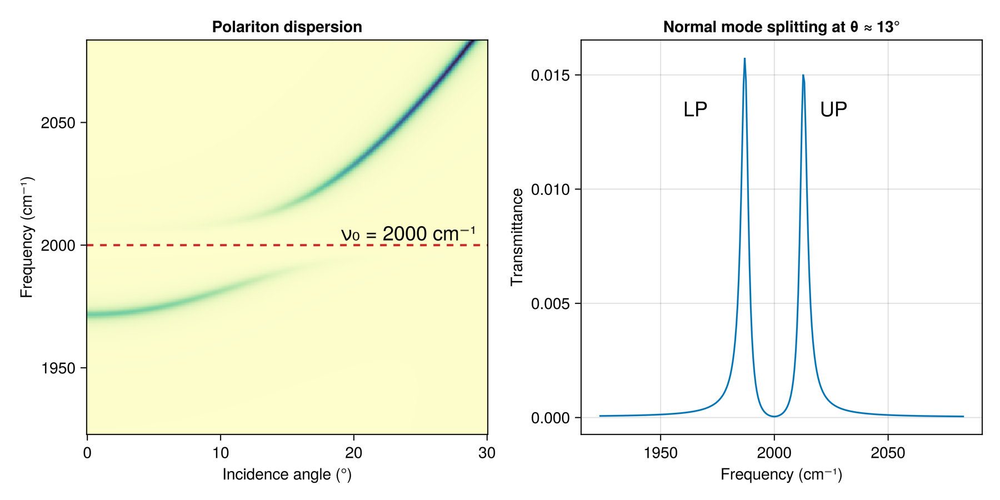
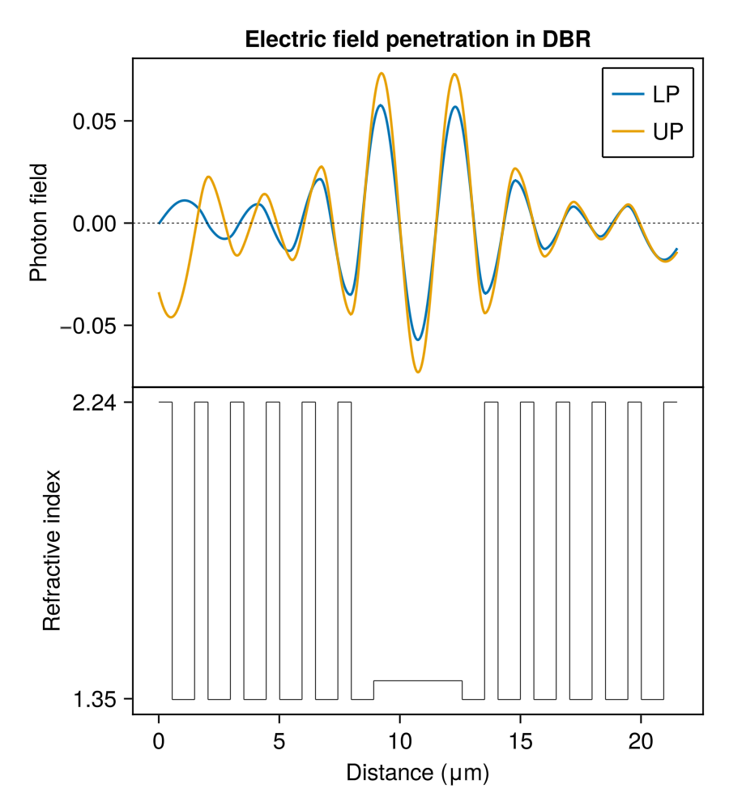

# TransferMatrix.jl

TransferMatrix.jl provides a general 4x4 transfer matrix method for optical waves propagating in layered media implemented in Julia.
The core is an electrodynamics simulation based on a general 4x4 transfer matrix method developed by Passler, et al.
Recent corrections and improvements are incorporated to deal with singularities and numerical instabilities for some types of multi-layered structures.
Sources are cited both in the documentation and docstrings where appropriate.
A comprehensive [bibliography](https://garrek.org/TransferMatrix.jl/stable/bibliography/) is also available as part of the documentation.

There are a lot of transfer matrix programs out there. Many are
proprietary and some are part of graduate theses. The problem
with the proprietary ones are that the source code cannot be examined 
nor modified (and are not free). The problem with programs 
written for papers are that they are rarely maintained, are not
well documented, are not well tested, and are poorly organized.
This makes it very difficult to use them. TransferMatrix.jl 
solves these problems and provides the first generalized 4x4 transfer matrix algorithm
available for Julia.

```@raw html
<div style="text-align: center;">


</div>
```


## API

Only exported types and functions are considered part of the public API.
All of these objects are documented in this manual. If not, please [open an issue](https://github.com/garrekstemo/TransferMatrix.jl/issues/new).
The advanced user is encouraged, however, to access the guts of TransferMatrix.jl and modify portions to achieve a desired outcome or test a different approach to the algorithm.
This implementation is as modular as possible to maximize flexibility;
each function is as small as possible so that the user may easily change any step along the way in calculating the transfer matrix, reflection or transmission spectra, electric field profile, etc.


## Issues and contributions

If you spot any errors or improvements to make, please [open an issue](https://github.com/garrekstemo/TransferMatrix.jl/issues/new) and if you want to contribute consider making a [pull request](https://github.com/garrekstemo/TransferMatrix.jl/pulls).