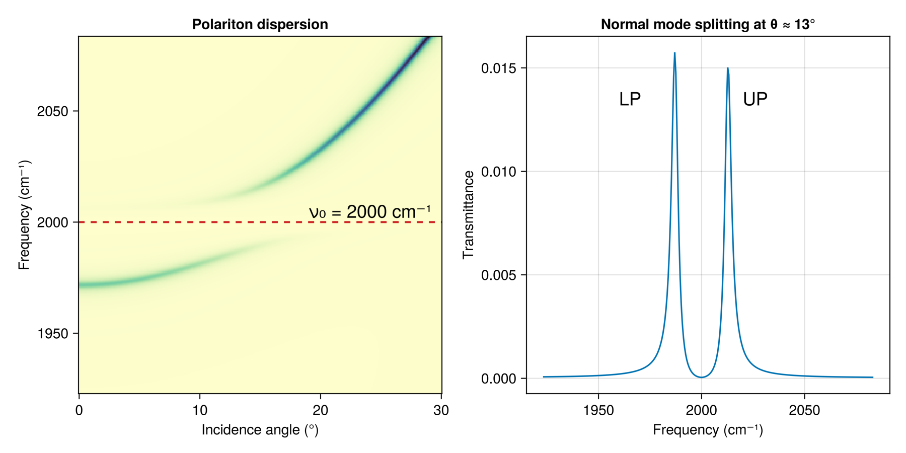

# TransferMatrix.jl

TransferMatrix.jl provides a general 4x4 transfer matrix method for optical waves propagating in layered media implemented in Julia.
The core is an electrodynamics simulation built on the 4x4 transfer-matrix formalism for stratified, anisotropic media — rooted in Berreman's original matrix formulation and the refinements developed since, including Yeh's treatment of birefringent layers and Xu et al.'s singularity-free eigenmode handling.
Further corrections and improvements deal with singularities and numerical instabilities that arise for some multi-layered structures.
Sources are cited both in the documentation and docstrings where appropriate.
A comprehensive [bibliography](bibliography.md) is also available as part of the documentation.

```@raw html
<div style="text-align: center;">

</div>
```


## API

Only exported types and functions are considered part of the public API.
All of these objects are documented in this manual. If not, please [open an issue](https://github.com/garrekstemo/TransferMatrix.jl/issues/new).
The advanced user is encouraged, however, to access the guts of TransferMatrix.jl and modify portions to achieve a desired outcome or test a different approach to the algorithm.
This implementation is as modular as possible to maximize flexibility;
each function is as small as possible so that the user may easily change any step along the way in calculating the transfer matrix, reflection or transmission spectra, electric field profile, etc.


## Issues and contributions

If you spot any errors or improvements to make, please [open an issue](https://github.com/garrekstemo/TransferMatrix.jl/issues/new) and if you want to contribute consider making a [pull request](https://github.com/garrekstemo/TransferMatrix.jl/pulls).